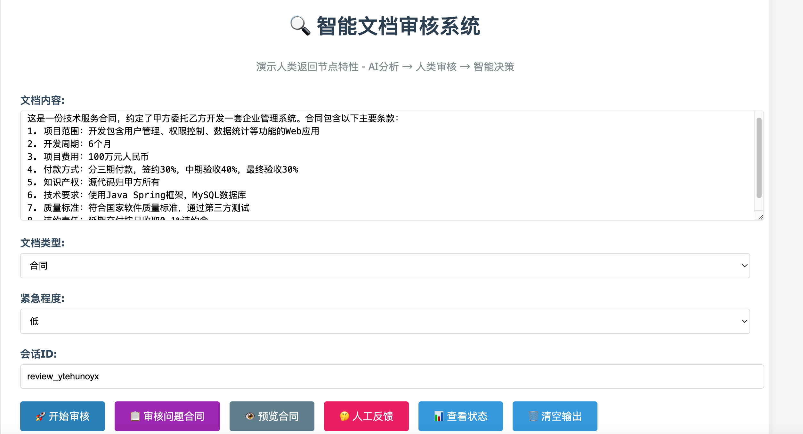
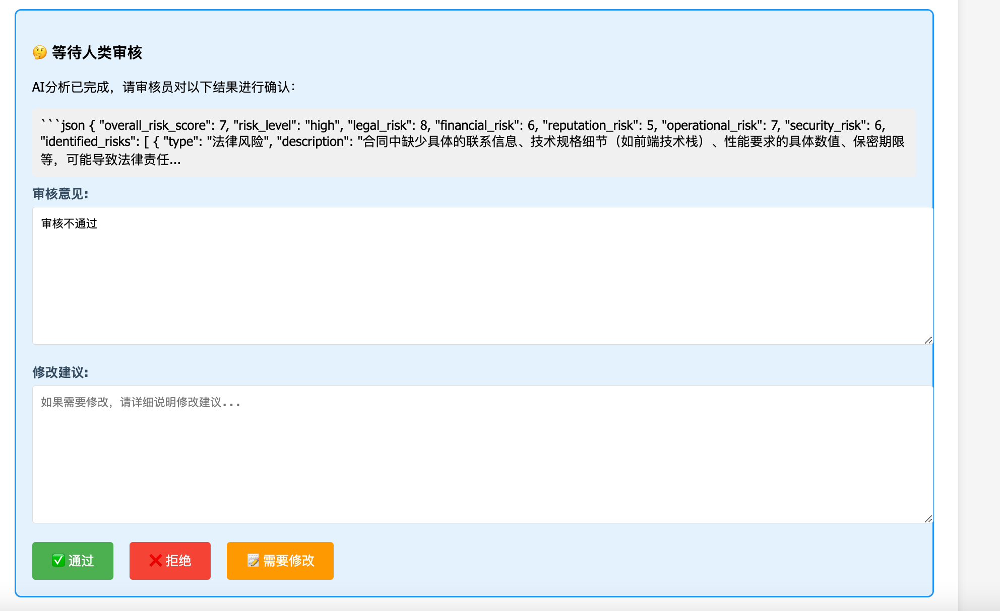
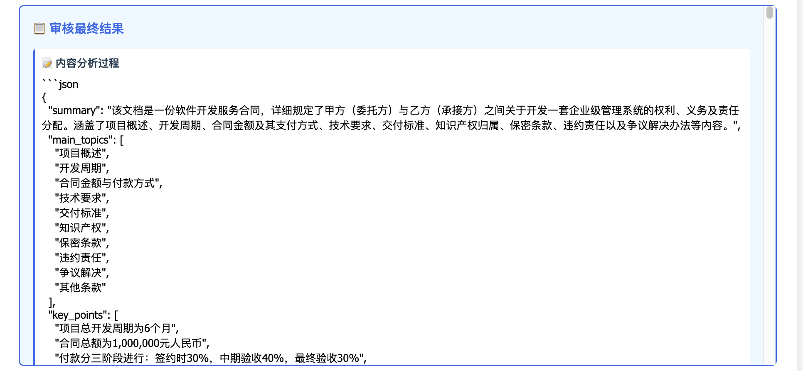

# 智能文档审核系统

## 项目简介

这是一个基于 Spring AI Alibaba 的智能文档审核系统，专门演示 **人类反馈节点** 特性。该系统模拟了企业中真实的文档审核场景，展示了AI与人类协作的完整工作流程。

## 核心特性

### 🎯 人类返回节点演示
- **AI 初步分析**：系统首先使用AI对文档进行内容分析、合规检查和风险评估
- **人类审核确认**：工作流暂停，等待人类审核员对AI分析结果进行确认
- **基于反馈的流程分支**：根据人类审核员的决策（通过/拒绝/修改），自动跳转到不同的后续处理流程

### 🔄 完整的审核工作流
1. **内容分析节点** - AI分析文档主题、结构、质量等
2. **合规检查节点** - 检查文档是否符合相关规范和标准
3. **风险评估节点** - 评估文档可能带来的各种风险
4. **人类审核节点** - **核心节点**，等待人类确认和决策
5. **分支处理节点** - 根据人类决策执行不同的后续流程：
   - 审批处理（通过）
   - 拒绝处理（拒绝）
   - 修改指导（需修改）
6. **最终报告节点** - 生成完整的审核报告

## 技术架构

- **Spring AI Alibaba**: 核心AI框架
- **StateGraph**: 工作流编排引擎
- **HumanNode**: 人类返回节点特性
- **Server-Sent Events**: 实时流式输出
- **Memory Saver**: 状态持久化

## 快速开始

### 1. 环境准备
```bash
# 需要 Java 17+
java -version

# 需要配置通义千问API密钥
export AI_DASHSCOPE_API_KEY=your-api-key-here
```

### 2. 启动应用
```bash
mvn spring-boot:run
```

### 3. 测试流程

#### 方式一：使用预设的问题合同（推荐）
```bash
# 审核预设的问题合同
curl -N "http://localhost:8090/document/review/contract?thread_id=contract123"

# 预览合同内容
curl "http://localhost:8090/document/review/contract/preview"
```

#### 方式二：自定义文档内容
```bash
# 开始文档审核（自定义内容）
curl -N "http://localhost:8090/document/review/start?document_content=这是一份技术合同，包含了软件开发的相关条款和技术要求&document_type=contract&urgency_level=high&thread_id=test123"
```

#### 等待AI分析完成后，人类审核员提供反馈
```bash
# 通过审核
curl -N "http://localhost:8090/document/review/continue?thread_id=test123&action=approve&comments=文档内容符合要求，可以通过"

# 拒绝审核
curl -N "http://localhost:8090/document/review/continue?thread_id=test123&action=reject&comments=存在重大风险，建议拒绝"

# 需要修改
curl -N "http://localhost:8090/document/review/continue?thread_id=test123&action=modify&comments=部分条款需要调整&suggested_changes=建议修改第3条和第7条的表述"
```

#### 查看审核状态
```bash
curl "http://localhost:8090/document/review/status?thread_id=test123"
```

## 工作流程图

```
开始 → 内容分析 → 合规检查 → 风险评估 → 人类审核 → {
    通过 → 审批处理 → 最终报告 → 结束
    拒绝 → 拒绝处理 → 最终报告 → 结束  
    修改 → 修改指导 → 最终报告 → 结束
}
```

## 人类返回节点详解

### 暂停机制
工作流在 `human_review` 节点会自动暂停，等待人类输入：
```java
.compile(CompileConfig.builder()
    .saverConfig(saverConfig)
    .interruptBefore("human_review")  // 在人类审核节点前暂停
    .build())
```

### 状态恢复
人类提供反馈后，从暂停状态恢复执行：
```java
StateSnapshot stateSnapshot = compiledGraph.getState(runnableConfig);
OverAllState state = stateSnapshot.state();
state.withResume();
state.withHumanFeedback(new OverAllState.HumanFeedback(feedbackData, ""));
```

### 条件分支
根据人类反馈决定后续流程：
```java
.addConditionalEdges("human_review", 
    AsyncEdgeAction.edge_async(new ReviewDecisionDispatcher()), 
    Map.of(
        "approval_process", "approval_process",
        "rejection_process", "rejection_process", 
        "modification_process", "modification_process"
    ))
```

## API 接口

### 审核预设合同
- **GET** `/document/review/contract`
- **参数**: `thread_id`
- **返回**: Server-Sent Events 流
- **说明**: 使用内置的问题合同进行审核演示

### 预览合同内容
- **GET** `/document/review/contract/preview`
- **参数**: 无
- **返回**: JSON 格式的合同内容和元信息

### 开始自定义审核
- **GET** `/document/review/start`
- **参数**: `document_content`, `document_type`, `urgency_level`, `thread_id`
- **返回**: Server-Sent Events 流

### 继续审核
- **GET** `/document/review/continue`
- **参数**: `thread_id`, `action`, `comments`, `suggested_changes`
- **返回**: Server-Sent Events 流

### 查看状态
- **GET** `/document/review/status`
- **参数**: `thread_id`
- **返回**: JSON 状态信息

## 测试场景：

### AI 分析推断过程

执行分析： 
`curl -N "http://localhost:8090/document/review/contract?thread_id=contract123"`

---
返回结果：

```json
Document review output = NodeOutput{node=risk_assessment, state=OverAllState{data={content_analysis_result=```json
{
  "summary": "该文档是一份软件开发服务合同，详细描述了甲方（委托方）与乙方（承接方）之间关于开发一套企业级管理系统的各项条款，包括项目概述、开发周期、合同金额及付款方式、技术要求、交付标准、知识产权归属、保密条款、违约责任、争议解决办法及其他条款。",
  "main_topics": [
    "项目概述",
    "开发周期",
    "合同金额与付款方式",
    "技术要求",
    "交付标准",
    "知识产权",
    "保密条款",
    "违约责任",
    "争议解决",
    "其他条款"
  ],
  "key_points": [
    "项目总金额为¥1,000,000",
    "开发周期定为6个月",
    "付款分为签约时30%、中期验收40%、最终验收30%",
    "后端采用Java语言配合Spring Boot框架及MySQL数据库",
    "交付物包括完整的源代码、系统部署文档和用户操作手册",
    "系统源代码归甲方所有",
    "双方需遵守严格的保密协议",
    "对于逾期付款或交付，规定了相应的违约金计算方式"
  ],
  "structure_quality": 8,
  "language_quality": 7,
  "completeness": 7,
  "initial_concerns": [
    "缺少具体的联系信息（如甲方联系电话）",
    "未明确需求分析阶段和测试部署阶段的具体时间",
    "前端开发环境未指定",
    "性能要求部分缺失具体数值",
    "知识产权部分表述不完整（特别是开发过程中技术方案的所有权问题）",
    "保密期限未填写",
    "质量不符情况下的处理措施未明确",
    "合同有效期未定义"
  ]
}


### 分析说明：
- **结构质量**：文档条理清晰地列出了合同的主要组成部分，但某些关键细节如阶段时间划分不够明确。
- **语言质量**：整体上使用了专业术语，但在一些地方缺乏具体性，导致理解上可能存在模糊。
- **完整性**：虽然涵盖了软件开发合同的基本要素，但仍有一些重要信息需要补充，比如具体的联系方式、更详细的性能指标等。
- **初步发现的问题**：指出了几处需要进一步澄清或补充的信息点，这对于确保合同执行过程中的透明度和可操作性非常重要。, risk_score=7, compliance_result=```json
  {
  "compliance_score": 6,
  "passed_checks": [
  "信息准确性和真实性",
  "格式规范性",
  "法律条款完整性（基本）",
  "权责明确性（基本）"
  ],
  "failed_checks": [
  "必要信息完整性",
  "语言规范性",
  "风险条款合理性"
  ],
  "warnings": [
  "缺少具体的联系信息（如甲方联系电话）",
  "未明确需求分析阶段和测试部署阶段的具体时间",
  "前端开发环境未指定",
  "性能要求部分缺失具体数值",
  "知识产权部分表述不完整（特别是开发过程中技术方案的所有权问题）",
  "保密期限未填写",
  "质量不符情况下的处理措施未明确",
  "合同有效期未定义"
  ],
  "recommendations": [
  "补充甲方的联系电话，确保双方能够有效沟通。",
  "详细说明各阶段的时间安排，特别是需求分析阶段和测试部署阶段，以增强项目的可预测性和管理。",
  "确定并记录前端开发所使用的具体技术和工具。",
  "设定清晰的性能指标，包括但不限于并发用户数、响应时间和系统可用性。",
  "完善知识产权条款，明确开发过程中产生的所有技术资料和技术方案的权利归属。",
  "规定保密协议的有效期，以及违反保密协议时的责任和后果。",
  "对不符合质量标准的情况制定具体的补救措施或违约责任。",
  "定义本合同的有效期，以避免任何可能的歧义或纠纷。",
  "考虑增加关于不可抗力事件及其影响的条款，以保护双方利益不受突发事件的影响。",
  "建议在争议解决部分明确仲裁机构的选择，以便于执行。"
  ],
  "overall_status": "needs-review"
  }


### 分析说明：
- **合规性评分**：综合考虑了文档的信息准确性、格式规范性、条款完整性等方面后，得分为6分。这表明虽然文档具备一定的合规基础，但仍有许多需要改进的地方。
- **通过的检查项**：文档在信息的真实性、格式的规范性方面表现良好，并且包含了一些基本的法律条款及明确了基本的权责关系。
- **未通过的检查项**：存在多处关键信息缺失或描述模糊的问题，特别是在技术细节、知识产权归属、违约责任等方面。此外，语言表达上也缺乏足够的精确度。
- **警告与建议**：针对发现的各项不足提出了具体的改进建议，旨在提高文档的整体质量和实用性，减少潜在的法律风险。, urgency_level=high, ai_analysis_result=```json
{
  "overall_risk_score": 7,
  "risk_level": "high",
  "legal_risk": 8,
  "financial_risk": 6,
  "reputation_risk": 5,
  "operational_risk": 7,
  "security_risk": 6,
  "identified_risks": [
    {
      "category": "法律风险",
      "description": "合同中知识产权归属不明确，可能引发权属争议；保密期限未定可能导致信息泄露后追责困难。"
    },
    {
      "category": "财务风险",
      "description": "付款条款虽然详细，但缺乏对质量不符情况下的处理措施，存在因质量问题导致成本超支的风险。"
    },
    {
      "category": "声誉风险",
      "description": "如果项目延期或交付质量不佳，可能会损害甲方的品牌形象，并引起公众及媒体的负面关注。"
    },
    {
      "category": "操作风险",
      "description": "需求分析和测试部署阶段的时间安排不明确，增加了项目管理难度和技术实施过程中的不确定性。"
    },
    {
      "category": "信息安全风险",
      "description": "由于保密协议的有效期未定义且前端开发环境未指定，增加了数据泄露和技术安全漏洞的风险。"
    }
  ],
  "mitigation_measures": [
    "与法律顾问合作，进一步细化和完善合同条款，特别是知识产权归属、保密协议有效期等方面。",
    "在合同中加入详细的性能指标要求以及对于不符合质量标准时的具体补救措施或违约责任说明。",
    "加强内部沟通机制建设，确保项目各阶段尤其是需求分析和测试部署阶段能够按时完成。",
    "明确并记录所有技术选择（如前端开发环境），同时增强网络安全防护措施以减少数据泄露可能性。",
    "建立应急响应计划，包括但不限于不可抗力事件处理策略，以最小化突发事件对企业运营的影响。",
    "考虑增加仲裁机构的选择说明于争议解决部分，提高争议解决效率和执行力。"
  ],
  "escalation_required": true
}


### 分析说明：
- **总体风险评分**：综合考量了各类潜在风险后给出的评分为7分，表明该合同存在较高的风险水平。
- **法律风险**：主要集中在知识产权分配不清、保密义务规定不足等问题上，这些都可能成为未来纠纷的导火索。
- **财务风险**：尽管支付条件较为合理，但由于缺少针对产品质量问题的明确赔偿机制，因此仍存在一定的经济损失隐患。
- **声誉风险**：任何执行过程中出现的重大延误或质量问题都有可能影响到企业的社会形象。
- **操作风险**：时间规划不够细致加上技术细节描述模糊，给实际操作带来了挑战。
- **信息安全风险**：考虑到现有文档中关于信息安全方面的描述较为薄弱，这使得保护敏感信息变得更加困难。
- **缓解措施建议**：通过加强条款细化、完善质量控制体系等手段来降低上述各种类型的风险。
- **是否需要上报**：鉴于当前存在的多方面高风险因素，建议将此评估结果提交至更高层级进行审查决策。, document_content= xxx
   , document_type=contract}, resume=false, humanFeedback=null, interruptMessage='null'}}
```
---

人工反馈：
`http://localhost:8080/document/review/continue?thread_id=contract123&action=modify&comments=部分条款需要调整&suggested_changes=建议修改第3条和第7条的表述`

```json
# 文档审核最终报告

## 执行摘要
本次审核针对一份合同文档进行，其紧急程度为高。基于AI分析结果及人工复核，我们发现该合同存在多方面的潜在风险，特别是法律、财务、声誉、操作和信息安全等方面。总体而言，此份合同的风险评分为7（满分为10），属于高风险级别。因此，建议对相关条款作出调整，并采取适当措施以降低风险水平。

## 审核过程概述
- **开始时间**：2025年6月26日 22:54:42
- **结束状态**：需修改
- **参与方**：
  - AI辅助系统提供了初步风险评估。
  - 专业人员进行了二次审查，并提出了具体意见。
- **主要活动**：包括但不限于文本内容的逐项检查、与现行法律法规对比分析、行业最佳实践参考等。

## 关键发现和风险点
### 风险概览
- 总体风险评分：7/10
- 法律风险：8/10
- 财务风险：6/10
- 声誉风险：5/10
- 操作风险：7/10
- 安全风险：6/10

### 具体问题
- 知识产权归属不明确，保密期限缺失；
- 缺少因质量不符而导致的成本控制机制；
- 项目延期或低质量交付可能损害品牌声誉；
- 时间管理与技术实施细节不够清晰；
- 信息安全管理薄弱，缺乏有效防护策略。

## 决策依据和理由
鉴于上述分析，我们认为当前版本的合同存在较高程度的不确定性及潜在危害，特别是在保护双方权益、确保服务质量以及维护信息安全等方面表现不足。为此，有必要根据所提建议对合同内容做出相应修正，以符合公司利益最大化原则并保障长期合作关系稳定发展。

## 后续行动计划
- **短期目标**：
  1. 根据本报告中列出的各项风险点，立即着手修订合同文本。
  2. 就新增加或修改后的条款与对方展开沟通协商。
- **中期规划**：
  3. 强化内部流程控制，比如建立更完善的项目管理体系。
  4. 提升员工对于合同重要性的认识，加强培训力度。
- **长期战略**：
  5. 不断优化和完善企业标准合同模板库。
  6. 密切关注相关政策法规变化，及时调整适应新的要求。

## 经验教训和改进建议
此次审核暴露出了我们在合同准备阶段的一些疏漏之处，未来应更加重视前期准备工作的重要性。此外，还应注意以下几点改进方向：
- 提前咨询法务专家，确保所有关键条款均得到妥善处理。
- 在谈判初期即确立清晰的质量标准和服务水平协议。
- 加强数据安全和个人隐私保护意识，在合同中予以体现。
- 定期组织跨部门协作会议，促进不同领域知识共享。

## 附件和参考文档
- [原始提交版本]([链接])
- [修订后版本]([链接])
- 相关政策文件与指导手册
- 往期类似案例研究报告

---

通过此次详尽而全面的审查工作，希望能够为今后更好地管理合同生命周期提供宝贵的经验积累。同时，也期待着能够尽快完成必要的调整工作，推动项目顺利开展。
```

## 效果（仅演示）





